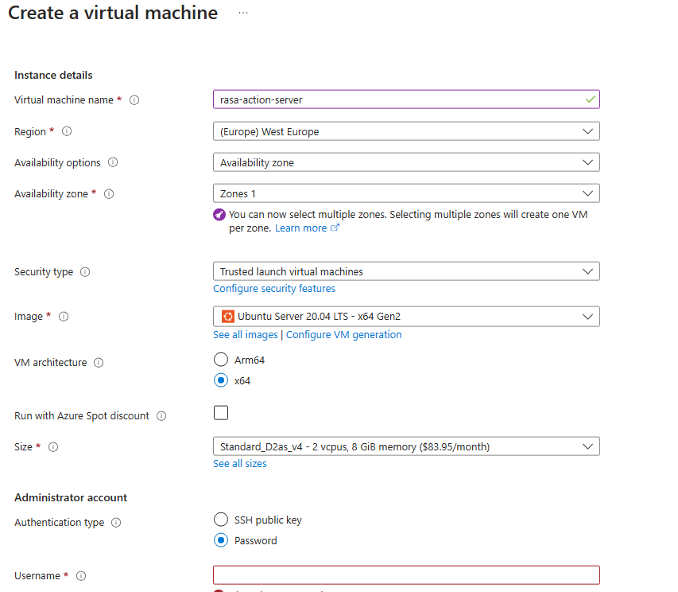
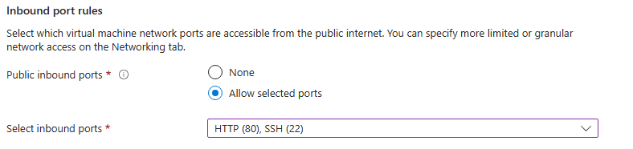
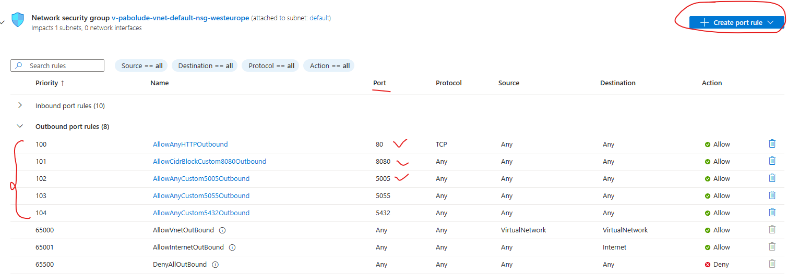

# Rasa Admissionbot

This chatbot is implemented using the Rasa framework, along with a frontend interface created using HTML, CSS, and JavaScript.

## Project Structure

The project is organized into the following directories and files:

- `actions/`: Contains custom action files for the chatbot.
- `data/`: Includes training data for the NLU (Natural Language Understanding) model.
- `frontends/`: Contains the frontend files for the user interface.
- `tests/`: Contains test data for chatbot stories.
- `config.yml`: Configuration file for Rasa NLU and Core models.
- `credentials.yml`: Contains credentials for external services (if any).
- `domain.yml`: Defines the chatbot's domain and actions.
- `endpoints.yml`: Contains configuration for connecting to external services.
- `graph.html`: HTML file for a graphical representation of chatbot interactions.
- `runrasa.sh`: Shell script to run the Rasa server.
- `Dockerfile`: Dockerfile for building the Rasa server container.
- `frontends/Dockerfile`: Dockerfile for building the frontend container.
- `docker-compose.yml`: Docker Compose file to run both the Rasa server and frontend.

## Configuring the containers on the Azure VM

- Create an [Azure Linux VM](https://portal.azure.com). Use the configurations below:

    

    - Open port 22 for ssh and port 80 to access the frontend

    

    - Leave the other information in default and create the VM

    - When the creation is done, click the network settings section and configure the outbound ports using this template

    

### Running the containers on the VM

1. ssh into the virtual machine.
2. Clone this repository the virtual machine.
    `git clone https://github.com/MESHEmugles/admissionbot`
3. Make sure you have Docker and Docker compose installed.
4. Open a terminal and navigate to the project directory.

### Running the Chatbot and Frontend

- Change the value of server_IP in `/frontends/static/js/components/chat.js`:

    - When testing locally, use `localhost`
    - When hosted, use the IP of the server.

- Run the docker compose commands to build the images and run the containers

```bash
# Make the models executable

chmod a+rwx models/

# Build the rasa and action_server containers
docker compose build [service_name] –-no-cache

# Start the containers
docker compose up -d --force-recreate
```

<pre>This will start both the Rasa server and the frontend in the same container. The Rasa server will be available at `http://{server_IP}:5005`, and the frontend will be available at `http://{server_IP}`. </pre>

### Accessing the Chatbot

Open a web browser and navigate to `http://{server_IP}` to access the chatbot interface. You can interact with the chatbot by sending messages in the chat interface.

## Customization

- Customize the chatbot's behavior by editing the `data/nlu.yml` and `data/stories.yml` files.
- Add new custom actions or modify existing ones in the `actions/actions.py` file.

## Credits

This project is based on the Rasa framework and includes a simple frontend interface.

## License

This project is licensed under the [MIT License](LICENSE).

Feel free to customize the README to match your project's specific details and requirements.
